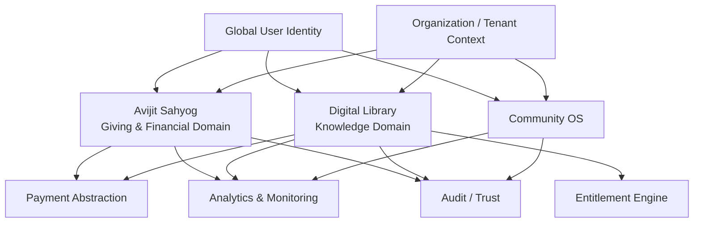

# Avijit Sahyog — Giving Layer Vision

## 1. Product role

Avijit Sahyog is the **giving and financial layer** of a broader Community OS.

Its immediate product remains a trusted, multilingual donation platform. Its long-term architecture should allow giving to connect to a shared global identity, community organizations, digital knowledge and platform intelligence without compromising financial integrity.

The broader ecosystem is:

**Community + Giving + Knowledge + Identity + Intelligence**

Avijit Sahyog should remain focused on giving rather than becoming a catch-all application. Integration with the other pillars should happen through explicit contracts and shared platform capabilities.

## 2. Product Vision

Build a trusted, multilingual donation platform that makes it simple for people to discover causes, understand where their money can be used, distribute a donation across causes, make payments through familiar UPI apps, and maintain a transparent history of their giving.

The long-term product is a **donation platform**, not merely a donation app.

It should support:
- Multiple causes / donation buckets
- Multiple affiliated organisations under each cause
- Flexible donation allocation
- One-time UPI donations
- Donation history and receipts
- Personal donation planning
- Monthly UPI AutoPay / recurring donations
- Multilingual content and UI
- Transparent administration and reconciliation
- Expansion to additional organisations and causes without an app release
- Integration with a shared global user identity
- Integration with organization/tenant context where giving is surfaced through Community OS
- Privacy-conscious giving analytics and monitoring

## 3. Relationship to the Digital Library

A future Digital Library is a separate knowledge domain, not part of the donation domain. It may share:
- Global user identity
- Organization/tenant context
- Payment abstraction
- Entitlement primitives
- Analytics and observability
- Localization infrastructure

The library proposal includes a monthly subscription, an initial **45 free reading minutes per user per month**, and paid reading/content access after the allowance according to configurable entitlements.

Avijit Sahyog may provide payment infrastructure or payment-domain contracts for eligible library transactions, but library access rules must remain owned by the Library/Entitlement domain.

## 4. Shared-platform architectural direction

## 5. Boundary rule

Avijit Sahyog owns financial truth for donations and giving transactions.

The platform must not blur:
- Donation intent with library entitlement
- Donation allocation with organization routing
- Payment status with client state
- Analytics with financial truth

Successful donations and allocations remain immutable. Historical donor intent must never be rewritten by later platform configuration.

## 6. Future ecosystem opportunities

The giving layer can eventually support:
- Donations surfaced inside tenant experiences
- Unified donor history across participating organizations where authorized
- Recurring giving plans
- Cause discovery across organizations
- Transparent impact stories
- Sponsored giving campaigns
- Potential payment services for other platform domains through explicit interfaces

The goal is to make giving a reusable platform capability while keeping the financial domain independently auditable and secure.
