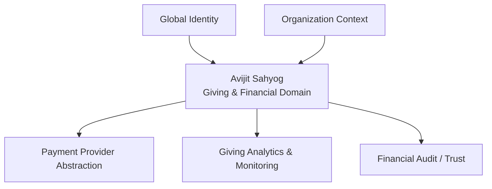

# Avijit Sahyog — Giving Platform Vision

## 1. Product role

Avijit Sahyog is focused exclusively on the **giving and financial domain**.

It should remain a trusted, multilingual donation platform rather than becoming a catch-all application. Any future integration with other platform capabilities should happen through explicit interfaces while financial ownership remains clear.

## 2. Product Vision

Build a trusted, multilingual donation platform that makes it simple for people to discover causes, understand where their money can be used, distribute a donation across causes, make payments through familiar UPI apps, and maintain a transparent history of their giving.

The long-term product is a **donation platform**, not merely a donation app.

It should support:
- Multiple causes / donation buckets
- Multiple affiliated organisations under each cause
- Flexible donation allocation
- One-time UPI donations
- Donation history and receipts
- Personal donation planning
- Monthly UPI AutoPay / recurring donations
- Multilingual content and UI
- Transparent administration and reconciliation
- Expansion to additional organisations and causes without an app release
- Integration with a shared global identity when appropriate
- Integration with organization/tenant context when giving is surfaced through a broader platform
- Privacy-conscious giving analytics and monitoring

## 3. Shared-platform boundaries

Avijit Sahyog owns financial truth for donations and giving transactions.

Shared platform capabilities may provide identity, organization context, analytics/monitoring and integration contracts, but they must not blur domain ownership.

The platform must not blur:
- Donation intent with another domain's entitlement or access rules
- Donation allocation with organization routing
- Payment status with client state
- Analytics with financial truth

Successful donations and allocations remain immutable. Historical donor intent must never be rewritten by later platform configuration.

## 4. Financial architecture

## 5. Donor experience

A donor should be able to:

1. Open the app.
2. Understand the platform and supported causes.
3. Explore causes such as Jeev Daya.
4. See affiliated organisations under a cause.
5. Choose a donation amount.
6. Distribute the amount by percentage, equal share or configured selection.
7. Review the exact allocation.
8. Start a UPI payment.
9. Complete the payment and return to the app.
10. See the verified donation status.
11. Receive/download a receipt.
12. View past donations.
13. Create a planner such as ₹2/day or ₹5/day.
14. Later convert the planner into a monthly UPI AutoPay mandate.

## 6. Allocation model

A donor allocates money **only across Causes**. Affiliated Organisations are discovery and transparency entities beneath a Cause; the donor is never required to choose which organisation receives an allocation.

The platform records donor intent as:

`Donation → DonationAllocation → Cause`

Any later organization-level routing, settlement or reconciliation is an administrative/platform responsibility and must not retroactively change the donor's recorded cause allocation.

For every successful donation:

`sum(allocation amounts) == donation amount`

## 7. Payment architecture

### One-time donation

Preferred flow:

Flutter → Backend → UPI Intent → Installed UPI app → Return to Flutter → Backend verification/reconciliation.

The Flutter callback is not the final source of truth.

### Recurring donation

Later phase:

Flutter → Backend → UPI AutoPay mandate registration → User approval → Mandate active → Scheduled debit → Provider callback/webhook → Donation creation → Receipt.

Recurring payments should not be implemented as a custom payment mechanism.

## 8. Multilingual architecture

Flutter UI strings use Flutter localization resources.

Backend-managed content uses translation records. English is the mandatory fallback. Initial target languages are English, Hindi, Marathi and Gujarati.

## 9. Security principles

Never store UPI PIN, card CVV, card credentials, banking passwords or other payment credentials belonging with the payment provider.

The backend must validate authenticated users, allocation totals and payment status; prevent duplicate processing; maintain audit records; verify callbacks/webhooks; and make financial records immutable after successful completion.

## 10. MVP boundary

### MVP includes
- Multilingual shell
- Home / information experience
- Causes
- Affiliated organisations
- Organisation details
- Optional user authentication with public browsing
- Role-based admin access
- Donation planner without automatic payment
- Donation allocation UI
- Donation domain model
- Basic admin/content model
- Beneficiary / impact explorer
- Automated tests
- CI/CD foundation

### MVP excludes
- Live payment collection
- UPI AutoPay
- Settlement/distribution automation
- Complex financial reconciliation
- Microservices
- Kubernetes
- Advanced analytics
- Large-scale notification campaigns

The architecture remains payment-ready without making payment implementation a prerequisite for the information MVP.

## 11. Definition of Done

A feature is done when UI, required API/domain behavior, validation, error states, relevant automated tests, localization, accessibility/basic responsive behavior, documentation and CI requirements are satisfied.

## 12. Long-Term Giving Vision

The platform should eventually allow a donor to say:

> "I want to give ₹5 every day."

and turn that intention into a transparent, manageable giving plan across causes and participating organizations, while giving the donor confidence about where the money is intended to go, what was actually paid, what was allocated, what receipt was issued and what recurring commitments are active.

The product succeeds when donating becomes simple, transparent, multilingual and repeatable.

## 13. Testing & Quality Target

- 70% overall line coverage as the project matures
- 80%+ coverage for new domain/service logic
- 90%+ for critical financial, allocation and payment logic
- UI tests covering primary journeys and important empty/error states

CI must run analysis/build, automated tests and Prisma schema validation before merge.
